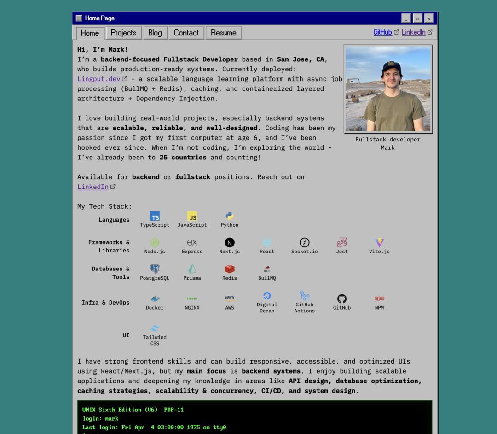
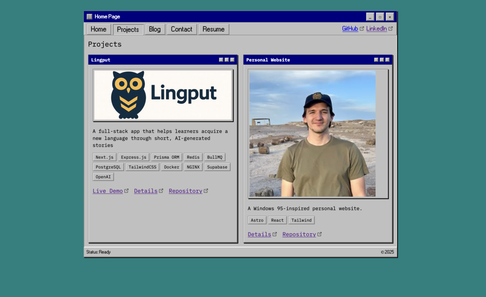

# Personal Website - Windows 95 Inspired Portfolio

A retro-styled personal portfolio website that combines nostalgic Windows 95 aesthetics with modern web development practices.

[](https://app.netlify.com/projects/markmdev/deploys)

## 🖥️ Live Demo

**Website:** [https://markmdev.com/](https://markmdev.com/)

## 📊 Performance & Quality

- **Perfect Lighthouse Scores:** 100/100 across Performance, Accessibility, Best Practices, and SEO
- **Load Time:** Sub-500ms first contentful paint
- **Accessibility:** Full screen reader compatibility with semantic HTML and ARIA roles
- **SEO Optimized:** Perfect search engine optimization score

## 📸 Screenshots





## ✨ Features

- **Retro Windows 95 UI** - Authentic pixel-perfect design with custom components
- **Responsive Design** - Works seamlessly on desktop and mobile while maintaining retro aesthetic
- **Interactive Elements** - Clickable windows, hover effects, and smooth animations
- **Project Showcase** - Dedicated sections for technical projects with live demos
- **Blog System** - Integrated technical writing platform
- **Performance Optimized** - Fast loading times with static site generation
- **Accessibility First** - Semantic HTML and ARIA roles for screen readers

## 🛠️ Tech Stack

- **Framework:** [Astro](https://astro.build/) - Static site generation with component islands
- **Styling:** [Tailwind CSS](https://tailwindcss.com/) with custom Windows 95 theme
- **Fonts:** IBM Plex Mono, IBM_VGA_8x16, Microsoft Sans-Serif
- **Deployment:** [Netlify](https://netlify.com/) with automated CI/CD
- **Build Tools:** Vite, GitHub Actions

## 🚀 Quick Start

### Prerequisites

- Node.js 18+
- npm or yarn

### Installation

```bash
# Clone the repository
git clone https://github.com/markmdev/personal_website.git
cd personal_website

# Install dependencies
npm install

# Start development server
npm run dev
```

Visit `http://localhost:4321` to see the site locally.

### Build for Production

```bash
# Build static files
npm run build

# Preview production build
npm run preview
```

## 📁 Project Structure

```
/
├── public/           # Static assets (images, fonts, etc.)
├── src/
│   ├── components/   # Reusable Astro components
│   ├── layouts/      # Page layouts
│   ├── pages/        # Route pages
│   ├── styles/       # Global CSS and Tailwind config
│   └── images/       # Optimized images
├── astro.config.mjs  # Astro configuration
```

## 🎨 Design System

### Windows 95 Theme

- **Colors:** Authentic Windows 95 palette (silver, blue, gray)
- **Typography:** Pixel-perfect fonts matching the original OS
- **Components:** Custom window frames, buttons, and form elements
- **Responsive:** Maintains retro feel across all screen sizes

### Key Components

- `Window` - Main Window component
- `Win95Image` - Retro-styled image frame
- `Terminal` - Command-line interface

## 🔧 Customization

### Adding New Projects

1. Add project data to `src/pages/projects.astro`
2. Include screenshots in `public/projects/`
3. Create project page in `src/pages/projects/`

### Modifying Styles

- Custom styles in `src/styles/global.css`
- Component-specific styles in respective `.astro` files

## 📦 Deployment

The site automatically deploys to Netlify on every push to the main branch via GitHub Actions.

## 🤝 Contributing

While this is a personal portfolio, I welcome feedback and suggestions:

1. Fork the repository
2. Create a feature branch (`git checkout -b feature/improvement`)
3. Commit your changes (`git commit -am 'Add new feature'`)
4. Push to the branch (`git push origin feature/improvement`)
5. Open a Pull Request

## 📝 License

This project is licensed under the MIT License - see the [LICENSE](LICENSE) file for details.

## 🙋‍♂️ Author

**Mark Morgan**

- Website: [markmdev.com](https://markmdev.com)
- LinkedIn: [linkedin.com/in/markmdev](https://linkedin.com/in/markmdev)
- GitHub: [github.com/markmdev](https://github.com/markmdev)

## 🙏 Acknowledgments

- Windows 95 design inspiration from Microsoft's original OS
- IBM Plex font family for modern typography
- Astro community for excellent documentation and support
